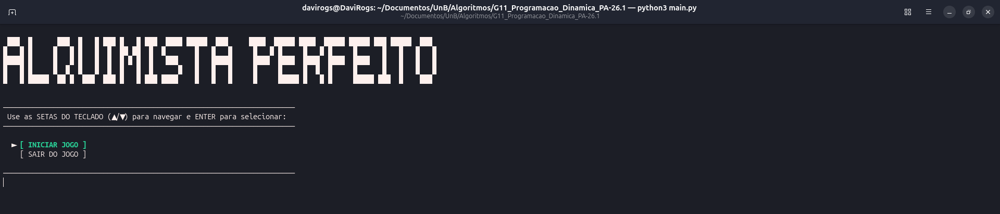
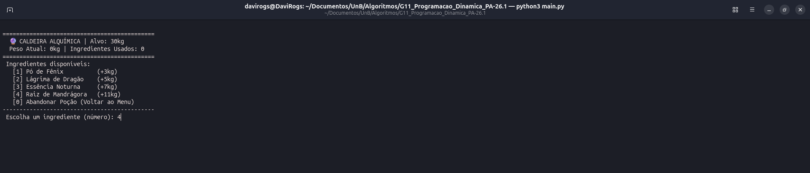
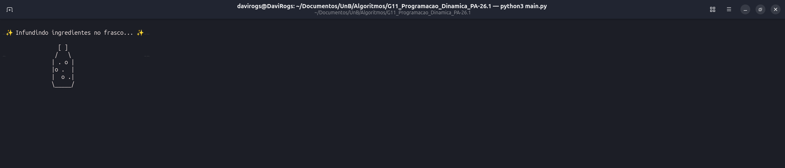
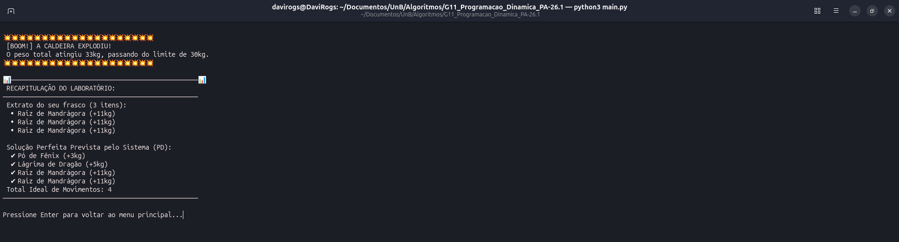
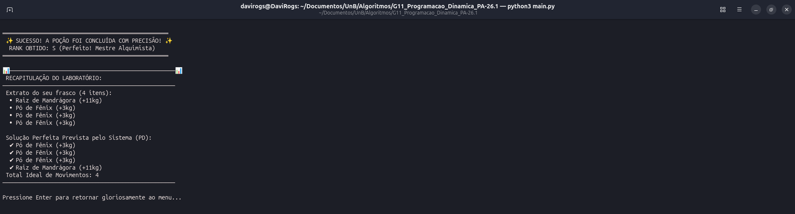

# Alquimista Perfeito - Selos

Conteudo da Disciplina: Programação Dinâmica<br>

## Alunos

| Matricula | Aluno                     |
| --------- | ------------------------- |
| 211061583 | Daniel Rodrigues da Rocha |
| 211061618 | Davi Rodrigues da Rocha   |

## Sobre

O Alquimista Perfeito é um jogo de terminal que aplica de forma lúdica os conceitos de Programação Dinâmica aprendidos em Projeto de Algoritmos. Baseado no problema do Coin Change, o projeto possibilita o jogador a assumir o papel de um alquimista que precisa combinar diferentes ingredientes mágicos (com pesos específicos de 3kg, 5kg, 7kg e 11kg) para atingir exatamente o peso alvo de uma poção.

Por trás dos panos, o algoritmo calcula a combinação ideal de ingredientes para atingir o peso alvo usando a seguinte relação de recorrência para minimizar a quantidade de itens:

$$dp[i] = \min(dp[i], dp[i - valor] + 1)$$

Ao finalizar o preparo (ou ao causar uma explosão na caldeira), o sistema compara o histórico de movimentos do jogador com a solução matematicamente perfeita encontrada pelo algoritmo, atribuindo um ranqueamento de desempenho (de S, para perfeição, até C, para rotas muito ineficientes).

## Screenshots











## Instalação

O projeto foi desenvolvido para rodar nativamente no terminal e não possui dependências externas.

### Pré-requisitos

- Python 3.14.4

### Passo a passo

1. Clone o repositorio:

```bash
git clone https://github.com/projeto-de-algoritmos-2026/G11_Programacao_Dinamica_PA-26.1.git
```

2. Entre na pasta do projeto:

```bash
cd G11_Programacao_Dinamica_PA-26.1
```

## Uso

Para iniciar o jogo, execute o arquivo principal do projeto (`main.py`) no seu terminal:

### Para Linux
```bash
python3 main.py
```

### Para Windows
```bash
python main.py
```

1. **Setas do Teclado (▲/▼):** No início do jogo, navegue pelas opções do menu.
2. **ENTER:** Confirma a seleção.
3. **Teclado Numérico:** Durante o jogo, digite o número correspondente ao ingrediente desejado e pressione ENTER para adicioná-lo à caldeira, ou 0 para abandonar a poção.

# Video de Apresentação
[Vídeo Apresentação da Entrega 3 - Programação Dinâmica]()